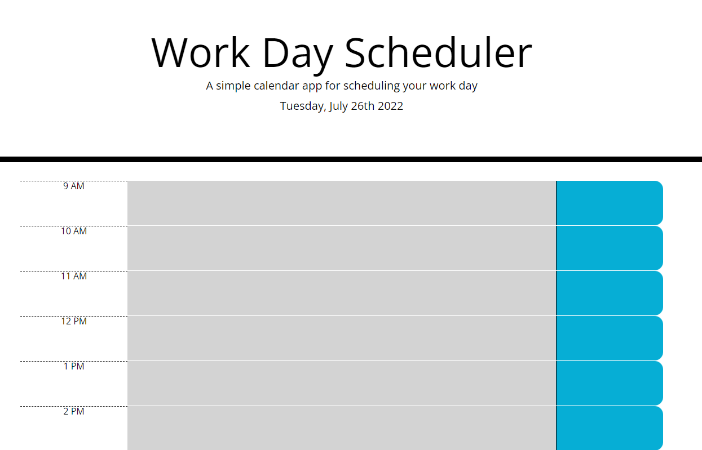

# Basic_Calander_App

Here is a very simple and effective event planner for day to day events. In it you can add/remove/and edit events for your busy scheduale as well as show you where in the day you currently sit.

[Link to App](https://capt-turner.github.io/Basic_Calander_App/)

# Screenshot

# Change Log

.1 - imported starting code, beginning psudo-code and display date

.2 - basic timeblock structure

.3 - improved timeblock structure 

.4 - adding color coding function

## Comments

Due to recent storms causing power outaged in my area, I have was not able to complete as much work as I would have liked. I also struggled with how to accept user input for events as the form elements kept breaking up all formating.